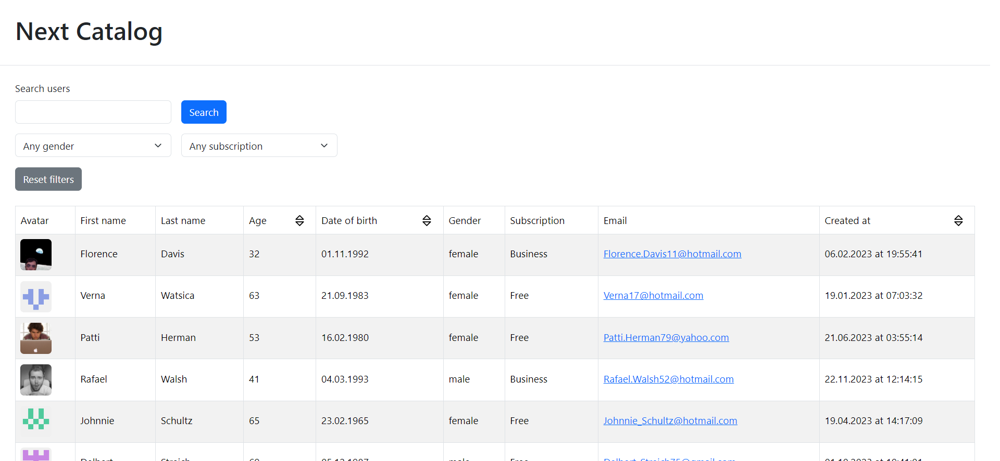

# Next Catalog

This project was the test task for employment. I needed to make a small **Next.js** app with a catalog of users that could be presented in a table view or a grid of cards view.

There should have been filtering and sorting, and pagination. One of the important conditions was to use libraries for some purposes or explain why didn't I use a library to write sth (see **Additional tools** below).

## 🚀 Launch

1. `git clone https://github.com/VladislavMaksimov/next-catalog`
2. `npm i`
3. Create a `.env.local` or `.env` file in the root folder. Copy the content of `.env.example` to the created file.
4. `npm run dev`

## ⚙️ Project Structure

The project was structured via [Feature-Sliced Design](https://feature-sliced.design/):

- `src/shared` - abstract and reusable components
- `src/features` - components containing business logic and providing value to users (i.e. search, sort, or filter users)
- `src/widgets` - complex components connecting features (in this case `UserTable` component is connected with fetching user and request error handling)

Using custom hooks to divide the logic of a component and its layout is inspired by [an article](https://martinfowler.com/articles/modularizing-react-apps.html) about the Presentation-Domain-Data approach in React apps.

## 🛠 Tools

**Main tools:** `Next.js` + `TypeScript`

**Additional tools:**

- `ESLint` + `Prettier`
- `Bootstrap` + `React Bootstrap` for styling components
- `TanStack Query` for HTTP requests handling
- `TanStack Table` for the table's logic handling
